# Maven基础

## 生命周期

Maven中有3套相互独立的生命周期:

* clean:清理工作。主要关注`clean`阶段

* default:核心工作，如:编译、测试、打包、安装、部署等。主要关注`compile` `test` `package` `install`阶段

* site:生成报告、发布站点等。

- clean:移除上一次构建生成的文件
- compile:编译项目源代码
- test:使用合适的单元测试框架运行测试(junit)
- package:将编译后的文件打包，如:jar、war等
- install:安装项目到本地仓库

在**同一套**生命周期中，当运行后面的阶段时，前面的阶段都会运行。

## 测试

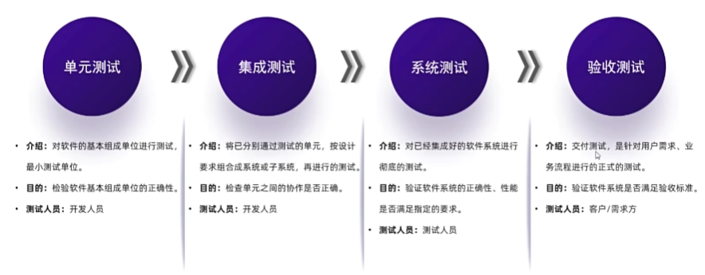

单元测试：白盒测试

集成测试：灰盒

系统测试：黑盒

验收测试：黑盒测试

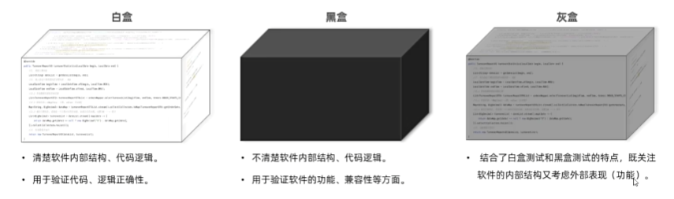

Junit编写单元测试，还有断言的功能。用的时候可以搜。

# Web入门

## HTTP协议

### 概述

超文本传输协议，规定了浏览器和服务器之间数据传输的规则。

特点:
1. 基于TCP协议:面向连接，安全
2. 基于请求-响应模型的:一次请求对应一次响应
3. HTTP协议是无状态的协议:对于事务处理没有记忆能力。每次请求-响应都是独立的。
   - 缺点:多次请求间不能共享数据。
   - 优点:速度快

### 请求协议

即 请求数据的格式，分为请求行、请求头、请求体

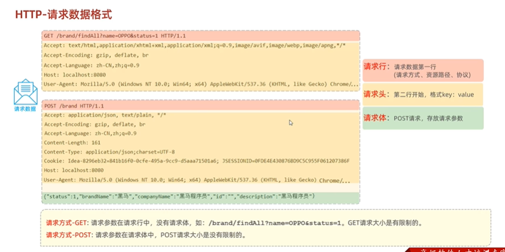

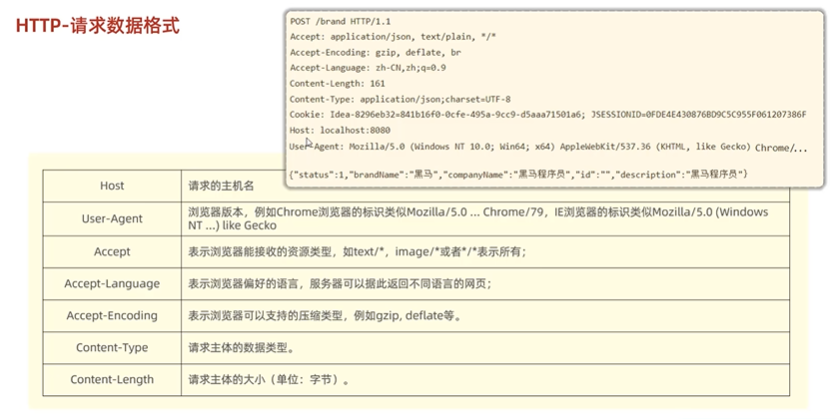

- 请求方式-GET:请求参数在请求行中，没有请求体，如:/brand/findA11?name=oPpo&status=1。GET请求大小是有限制的。
- 请求方式-POST:请求参数在请求体中，POST请求大小是没存限制的。

### 响应格式

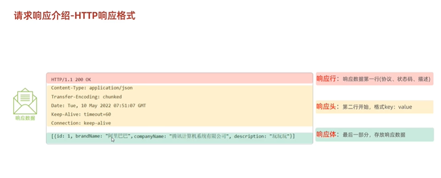

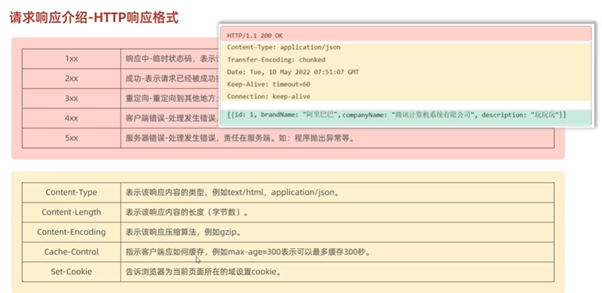

常见的响应状态码

| 状态码 | 英文描述 | 解释 |
|--------|----------|------|
| 200 | OK | 客户端请求成功，即处理成功，这是我们最想看到的状态码 |
| 302 | Found | 指示所请求的资源已移动到由Location响应头给定的URL，浏览器会自动重新访问到这个页面 |
| 304 | Not Modified | 告诉客户端，你请求的资源至上次取得后，服务端并未更改，你直接用你本地缓存吧，隐式重定向 |
| 400 | Bad Request | 客户端请求有语法错误，不能被服务器所理解 |
| 403 | Forbidden | 服务器收到请求，但是拒绝提供服务，比如：没有权限访问相关资源 |
| 404 | Not Found | 请求资源不存在，一般是URL输入有误，或者网站资源被删除了 |
| 405 | Method Not Allowed | 请求方式有误，比如应该用GET请求方式的资源，用了POST |
| 428 | Precondition Required | 服务器要求有条件的请求，告诉客户端要想访问该资源，必须携带特定的请求头 |
| 429 | Too Many Requests | 指示用户在给定时间内发送了太多请求（"限速"），配合Retry-After(多长时间后可以请求)响应头一起使用 |
| 431 | Request Header Fields Too Large | 请求头太大，服务器不愿意处理请求，因为它的头部字段太大。请求可以在减少请求头域的大小后重新提交。 |
| 500 | Internal Server Error | 服务器发生不可预期的错误，服务器出异常了，赶紧看日志去吧 |
| 503 | Service Unavailable | 服务器尚未准备好处理请求，服务器刚启动，还未初始化好 |

## 分层解耦

分为三个步骤：数据访问，逻辑处理，接受请求、响应数据

单一职责原则，利于代码可拓展性

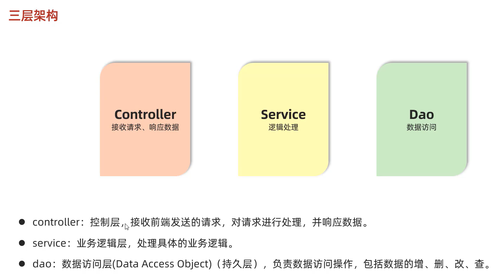

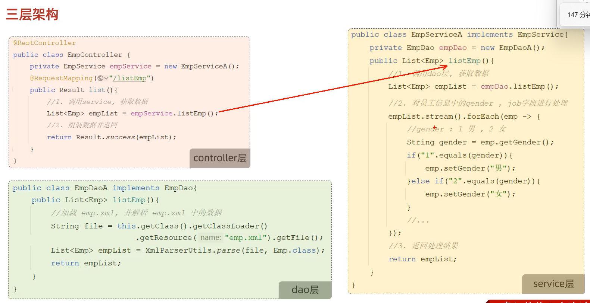

## 控制反转IOC和依赖注入DI

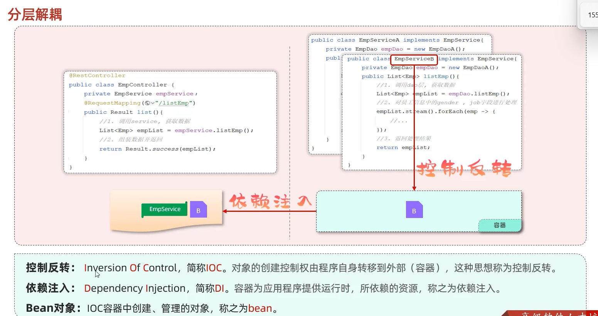

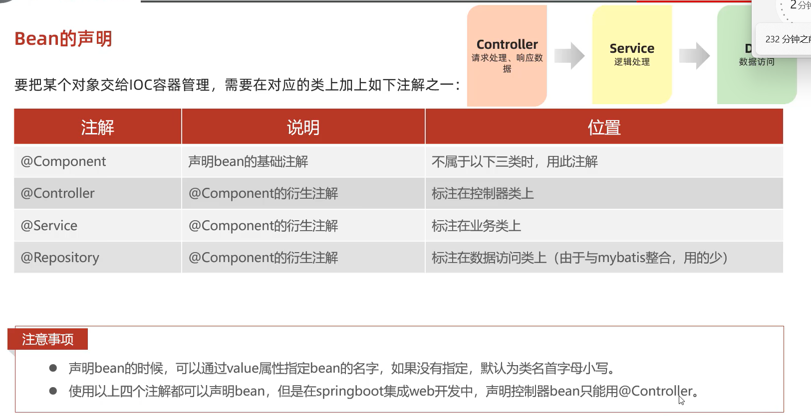

@SpringBootApplication 具有包扫描作用，默认扫描当前包及其子包，所以最好把代码放在启动类根目录下

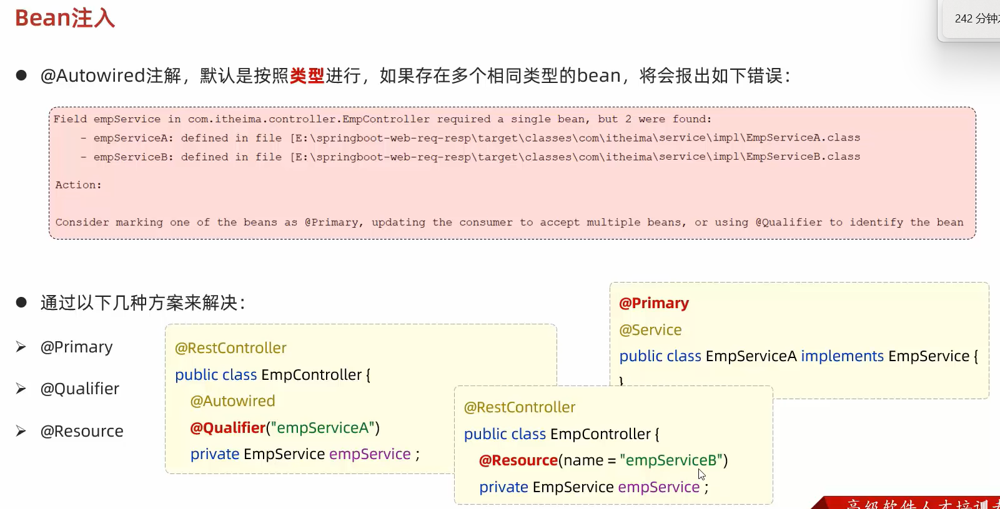
像Qualifier和Autowired这种，都是spring框架提供的，而Resource是jdk提供的

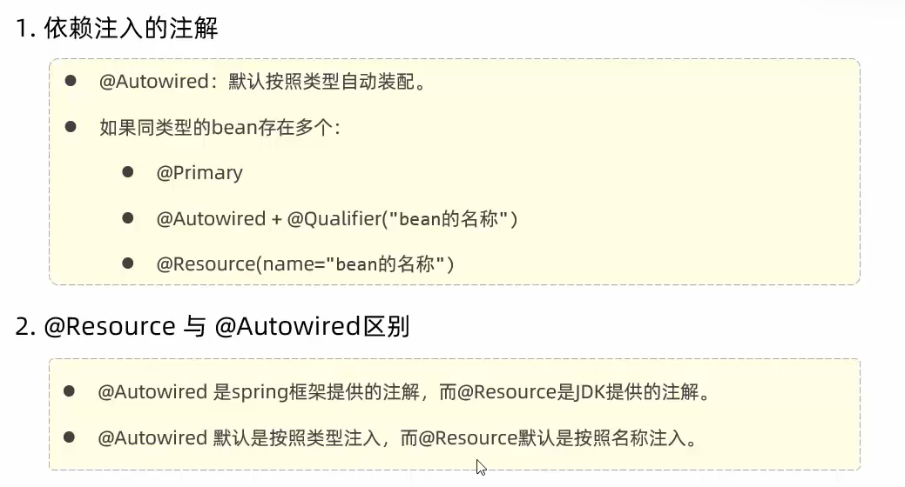

