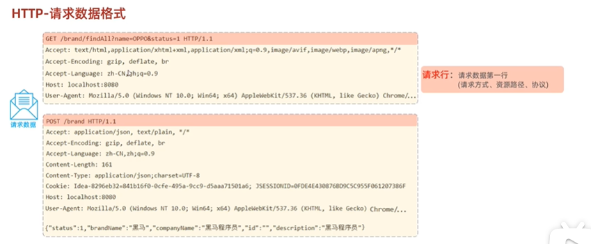

# Web入门

## HTTP协议

### 概述

超文本传输协议，规定了浏览器和服务器之间数据传输的规则。

特点:
1. 基于TCP协议:面向连接，安全
2. 基于请求-响应模型的:一次请求对应一次响应
3. HTTP协议是无状态的协议:对于事务处理没有记忆能力。每次请求-响应都是独立的。
   - 缺点:多次请求间不能共享数据。
   - 优点:速度快

### 请求协议

即 请求数据的格式，分为请求行、请求头、请求体

